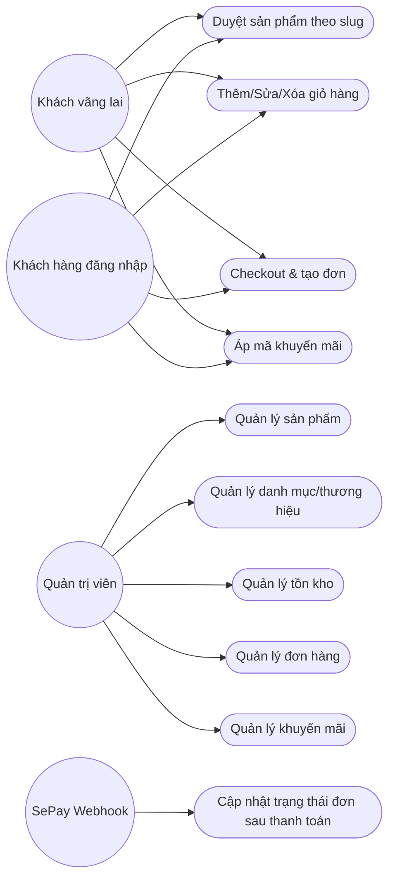
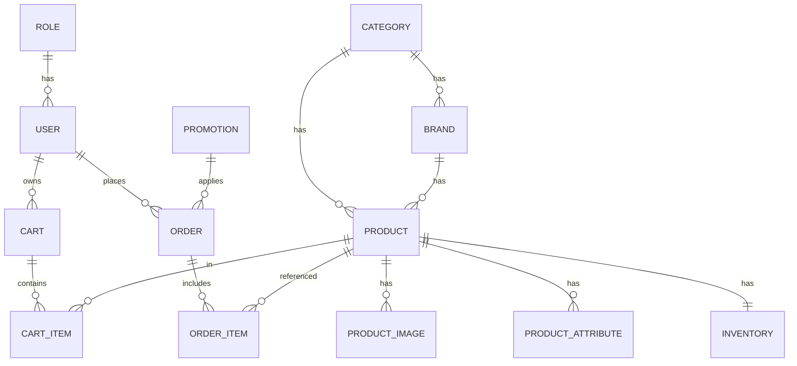
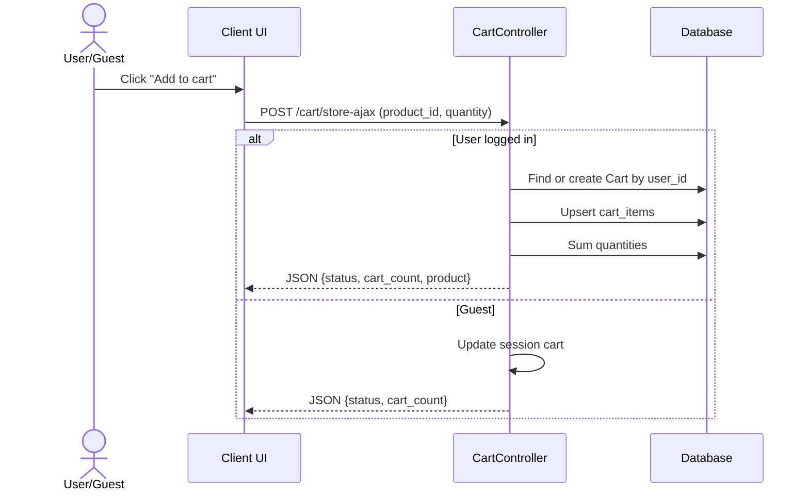
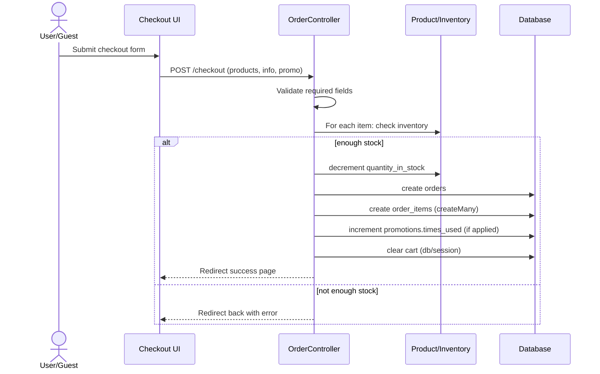
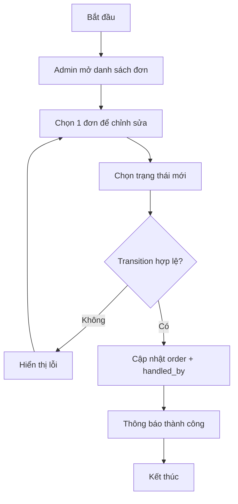

# BÁO CÁO LUẬN VĂN/ĐỒ ÁN

**Tên đề tài (đề xuất):** Xây dựng hệ thống quản lý bán hàng & website bán sản phẩm công nghệ

**Dự án:** DATTCN_QuanLyBangHang (Laravel 12 + Blade + AdminLTE)

**Ngày cập nhật:** 03/01/2026

> Ghi chú: Các mục “cần hình ảnh” mình để sẵn placeholder để bạn tự chèn ảnh/sơ đồ. Các sơ đồ dạng chữ (Mermaid) vẫn được cung cấp để bạn dễ chuyển sang ảnh nếu cần.

---

## Chương 1: Giới thiệu

### 1.1. Đặt vấn đề, mục tiêu luận văn

Trong bối cảnh thương mại điện tử phát triển mạnh, nhu cầu xây dựng các hệ thống bán hàng trực tuyến (website) kết hợp quản trị nội bộ (dashboard quản trị) ngày càng phổ biến. Một bài toán điển hình là quản lý danh mục sản phẩm, thương hiệu, tồn kho, đơn hàng, khuyến mãi và quy trình mua hàng (giỏ hàng → thanh toán → theo dõi trạng thái).

Dự án này xây dựng một hệ thống bán hàng gồm hai phần:

- **Phía khách hàng (Client):** xem danh mục/sản phẩm theo đường dẫn “slug”, xem chi tiết sản phẩm, thao tác giỏ hàng (thêm/sửa/xóa), checkout, áp mã giảm giá.
- **Phía quản trị (Admin):** quản lý danh mục, thương hiệu, sản phẩm (kèm ảnh/thuộc tính), tồn kho, đơn hàng, khuyến mãi và tài khoản; thống kê tổng quan trên dashboard.

**Mục tiêu tổng quát**

- Xây dựng website bán hàng có trải nghiệm mua sắm cơ bản, dễ sử dụng.
- Xây dựng trang quản trị giúp vận hành (CRUD dữ liệu, theo dõi đơn hàng, kiểm soát tồn kho).
- Tích hợp thanh toán/chuyển khoản tự động qua webhook (SePay) để cập nhật trạng thái đơn.

**Mục tiêu cụ thể**

- Thiết kế và cài đặt các thực thể dữ liệu chính: Category, Brand, Product, Product Images/Attributes, Inventory, Cart, Order, Promotion, User/Role.
- Xây dựng các luồng nghiệp vụ cốt lõi:
  - Duyệt sản phẩm theo danh mục/thương hiệu/slug.
  - Giỏ hàng cho cả **khách vãng lai (session)** và **người dùng đăng nhập (DB)**.
  - Checkout có kiểm tra tồn kho, ghi nhận đơn hàng, trừ tồn kho.
  - Áp dụng mã khuyến mãi theo điều kiện thời gian/lượt dùng.
  - Quản trị: cập nhật trạng thái đơn hàng theo luồng hợp lệ.
  - Webhook thanh toán: khi nhận tiền → cập nhật đơn hàng.

### 1.2. Những thách thức cần giải quyết

Các thách thức kỹ thuật/nghiệp vụ thường gặp khi xây dựng hệ thống bán hàng và cách tiếp cận trong dự án:

1) **Đồng bộ giỏ hàng giữa khách vãng lai và người dùng đăng nhập**
- Khách vãng lai: giỏ hàng lưu trong session.
- Người dùng đăng nhập: giỏ hàng lưu trong bảng carts/cart_items.
- Thách thức: nhất quán dữ liệu và trải nghiệm (hiển thị đúng số lượng/tổng tiền), tránh trùng lặp.

2) **Kiểm soát tồn kho và xử lý cạnh tranh (race condition)**
- Khi nhiều người mua cùng một sản phẩm, cần đảm bảo không bán vượt tồn.
- Hệ thống hiện có kiểm tra tồn kho trước khi tạo đơn và **trừ tồn kho ngay** khi tạo đơn.
- Rủi ro: nếu có lỗi sau khi trừ tồn mà đơn không được tạo/không thanh toán, sẽ lệch tồn kho (cần transaction/rollback hoặc cơ chế giữ hàng).

3) **Tính đúng giá trị giảm giá và điều kiện mã khuyến mãi**
- Điều kiện thời gian (starts_at/ends_at), trạng thái kích hoạt, giới hạn lượt dùng.
- Thách thức: chuẩn hóa kiểu discount_type và đảm bảo logic nhất quán giữa admin và client.

4) **Bảo mật và phân quyền**
- Admin routes yêu cầu đăng nhập và kiểm tra role (admin middleware).
- Thách thức: đảm bảo các API/route nhạy cảm không bị truy cập trái phép; tránh lộ thông tin đơn hàng.

5) **Tích hợp thanh toán tự động qua webhook**
- Webhook cần xác thực (token), parse nội dung để lấy mã đơn hàng, kiểm tra số tiền.
- Thách thức: idempotency (tránh cập nhật nhiều lần), log và xử lý ngoại lệ khi dữ liệu webhook không đúng.

6) **Quản lý ảnh sản phẩm và dữ liệu liên quan**
- Upload ảnh đại diện và ảnh gallery; xóa ảnh phải xóa cả file storage.
- Thách thức: tránh orphan files, đảm bảo sort_order cho ảnh.

### 1.3. Nội dung, phạm vi thực hiện

**Phạm vi chức năng (Functional scope)**

- Client:
  - Trang chủ hiển thị nhóm sản phẩm theo danh mục/brand.
  - Duyệt sản phẩm theo slug: danh mục, thương hiệu, hoặc sản phẩm.
  - Xem chi tiết sản phẩm và sản phẩm liên quan.
  - Giỏ hàng: thêm/sửa/xóa; hỗ trợ AJAX.
  - Checkout: nhập thông tin nhận hàng, chọn phương thức thanh toán, áp mã giảm giá.
  - Trang thành công đơn hàng.

- Admin:
  - Dashboard thống kê: tổng đơn, tổng sản phẩm, doanh thu, khách hàng, đơn gần đây, cảnh báo sắp hết hàng.
  - CRUD danh mục, thương hiệu, sản phẩm (kèm ảnh/thuộc tính), tồn kho, đơn hàng, khuyến mãi, tài khoản.
  - Cập nhật trạng thái đơn theo luồng hợp lệ.

**Phạm vi ngoài chức năng (Non-functional scope)**

- Xác thực người dùng bằng Laravel Auth.
- Phân quyền admin bằng middleware.
- Tích hợp frontend build bằng Vite.

**Ngoài phạm vi / hạn chế hiện tại (giới hạn)**

- Chưa mô tả cơ chế hoàn kho khi đơn bị hủy/không thanh toán.
- Chưa có cơ chế giữ hàng (reservation) theo thời gian.
- Chưa có hệ thống đánh giá sản phẩm, vận chuyển nâng cao, hoặc cổng thanh toán đa dạng.

### 1.4. Kết quả cần đạt

Bảng sau mô tả các kết quả mong đợi và tiêu chí đánh giá.

| Mã | Kết quả cần đạt | Nhóm | Tiêu chí đánh giá | Ghi chú |
|---:|---|---|---|---|
| KQ-01 | Duyệt sản phẩm theo danh mục/thương hiệu/sản phẩm | Chức năng | Route hoạt động; dữ liệu hiển thị đúng theo slug; xử lý slug sai điều hướng về trang chủ | Client ProductController::showBySlug |
| KQ-02 | Giỏ hàng hỗ trợ khách vãng lai và user login | Chức năng | Thêm/sửa/xóa; tổng tiền tính đúng; AJAX trả về cart_count đúng | Client CartController |
| KQ-03 | Checkout tạo đơn hàng + lưu order items | Chức năng | Tạo order_number duy nhất; lưu snapshot địa chỉ; lưu line_total; redirect trang success | Client OrderController::store |
| KQ-04 | Áp mã khuyến mãi | Chức năng | Kiểm tra hiệu lực/giới hạn; tính đúng discount; không vượt totalAmount | Client OrderController::applyDiscount |
| KQ-05 | Quản trị sản phẩm (CRUD + ảnh + thuộc tính) | Chức năng | Upload ảnh; sửa/xóa ảnh; thuộc tính tạo lại đúng; slug tạo theo category-brand-sku | Admin ProductController |
| KQ-06 | Quản trị tồn kho | Chức năng | Tạo/sửa/xóa bản ghi inventory; cảnh báo sản phẩm sắp hết | Admin InventoryController + Dashboard |
| KQ-07 | Quản trị đơn hàng | Chức năng | Xem/chi tiết; update trạng thái theo transition; xóa chỉ khi pending/cancelled | Admin OrderController |
| KQ-08 | Webhook thanh toán tự động (SePay) | Chức năng | Nhận webhook; parse mã đơn; kiểm tra số tiền; cập nhật đơn hoàn thành | SePayWebhookListener |
| KQ-09 | Bảo mật truy cập trang admin | Phi chức năng | Route admin yêu cầu auth + role admin; user thường bị chặn | AdminMiddleware |
| KQ-10 | Tính ổn định & log | Phi chức năng | Lỗi nghiệp vụ trả thông báo; webhook có log; tránh crash | try/catch, validation |
| KQ-11 | Hiệu năng cơ bản | Phi chức năng | Trang chủ dùng eager loading hợp lý; cache categories sidebar | ViewServiceProvider cache |

---

## Chương 2: Phương pháp thực hiện

### 2.1. Các hệ thống tương tự

Dưới đây là khảo sát một số hệ thống/nền tảng phổ biến và nhận xét để định hướng thiết kế.

1) **WooCommerce (WordPress)**
- Ưu điểm: triển khai nhanh, nhiều plugin, cộng đồng lớn.
- Nhược điểm: phụ thuộc WordPress; mở rộng tùy biến sâu có thể phức tạp; hiệu năng phụ thuộc hosting/plugin.

2) **Shopify**
- Ưu điểm: SaaS ổn định; thanh toán/vận hành mạnh; nhiều theme/app.
- Nhược điểm: chi phí định kỳ; hạn chế tùy biến ở mức sâu; phụ thuộc nền tảng.

3) **KiotViet/Sapo POS (giải pháp quản lý bán hàng tại VN)**
- Ưu điểm: quản lý bán hàng, tồn kho, đơn hàng, báo cáo rất mạnh; phù hợp vận hành thực tế.
- Nhược điểm: phụ thuộc nền tảng; tùy biến theo nghiệp vụ đặc thù bị giới hạn; tích hợp đặc thù có thể tốn chi phí.

**Kết luận khảo sát:** Dự án chọn hướng tự xây dựng (Laravel) để chủ động tùy biến nghiệp vụ (quản lý sản phẩm/đơn hàng/tồn kho/khuyến mãi) và tích hợp webhook thanh toán theo yêu cầu.

### 2.2. Cơ sở lý thuyết

Vì đây là **đề tài ứng dụng**, phần cơ sở lý thuyết chuyên sâu có thể lược bỏ. Tuy nhiên dự án vẫn dựa trên các khái niệm nền tảng:

- Mô hình kiến trúc MVC.
- Thiết kế CSDL quan hệ và ràng buộc khóa chính/khóa ngoại.
- Các quy trình nghiệp vụ TMĐT: cart → checkout → order → payment confirmation.

### 2.3. Công nghệ sử dụng

- **Laravel 12 (PHP 8.2+)**: framework backend theo MVC, routing, middleware, validation, ORM Eloquent.
- **Blade Template**: engine view server-side.
- **Eloquent ORM**: truy cập dữ liệu theo mô hình đối tượng, quan hệ hasMany/belongsTo.
- **Laravel UI / Auth**: scaffold đăng nhập/đăng ký.
- **AdminLTE**: giao diện quản trị.
- **Bootstrap 5 / TailwindCSS (qua Vite)**: UI layout, responsive.
- **Vite**: build asset frontend.
- **SePay Laravel package**: nhận webhook thanh toán và tách thông tin mã đơn hàng theo pattern.
- **Session**: lưu giỏ hàng cho khách chưa đăng nhập.
- **Cache**: cache danh mục/brand để giảm truy vấn sidebar.

### 2.4. Phân tích yêu cầu

#### 2.4.1. Các quy trình, nghiệp vụ

**(A) Quy trình duyệt sản phẩm theo slug**
- Người dùng truy cập `/{slug}`.
- Hệ thống phân tích slug:
  - Nếu là danh mục: hiển thị danh sách sản phẩm theo category.
  - Nếu là thương hiệu: hiển thị danh sách theo brand.
  - Nếu là sản phẩm: hiển thị chi tiết sản phẩm.

**(B) Quy trình giỏ hàng (khách vãng lai / đăng nhập)**
- Nếu đã đăng nhập: giỏ hàng lưu DB (Cart + CartItems).
- Nếu chưa đăng nhập: giỏ hàng lưu Session.
- Các thao tác: thêm, cập nhật số lượng, xóa sản phẩm, tính tổng tiền.

**(C) Quy trình checkout & tạo đơn hàng**
- Người dùng nhập thông tin nhận hàng (họ tên, email, SĐT, địa chỉ).
- Chọn phương thức thanh toán (mặc định COD).
- Hệ thống:
  - Kiểm tra giỏ hàng không rỗng.
  - Kiểm tra tồn kho từng sản phẩm.
  - Tính subtotal.
  - Nếu có promotion: tính discount, finalAmount.
  - Tạo Order và OrderItems.
  - Trừ tồn kho.
  - Xóa giỏ hàng.
  - Điều hướng sang trang success.

**(D) Quy trình quản trị sản phẩm**
- Admin tạo/sửa sản phẩm, tạo slug, upload ảnh đại diện và ảnh gallery.
- Quản lý thuộc tính sản phẩm (key/value).

**(E) Quy trình quản trị đơn hàng**
- Admin xem danh sách, xem chi tiết.
- Cập nhật trạng thái theo luồng hợp lệ:
  - pending → delivery hoặc cancelled
  - delivery → completed hoặc cancelled
  - completed/cancelled: không chuyển tiếp
- Ghi nhận người xử lý (handled_by).

**(F) Quy trình thanh toán tự động (Webhook SePay)**
- SePay gửi webhook giao dịch.
- Hệ thống tách mã đơn từ pattern (ví dụ “DH12345” → “12345”).
- Nếu giao dịch tiền vào (transferType=in) và số tiền ≥ total_amount:
  - cập nhật trạng thái đơn thành completed.

> **Placeholder hình ảnh quy trình:**
> - [ ] Hình: Sơ đồ BPMN/Flow quy trình mua hàng (cart → checkout → order)
> - [ ] Hình: Sơ đồ quy trình admin xử lý đơn hàng

#### 2.4.2. Sơ đồ chức năng

```mermaid
flowchart TB
  A[Hệ thống quản lý bán hàng] --> B[Khách hàng]
  A --> C[Quản trị viên]

  B --> B1[Xem danh mục/sản phẩm]
  B --> B2[Xem chi tiết sản phẩm]
  B --> B3[Giỏ hàng: thêm/sửa/xóa]
  B --> B4[Checkout: nhập thông tin]
  B --> B5[Áp mã khuyến mãi]
  B --> B6[Theo dõi trạng thái đơn (gián tiếp qua trang success)]

  C --> C1[Quản lý danh mục]
  C --> C2[Quản lý thương hiệu]
  C --> C3[Quản lý sản phẩm]
  C --> C4[Quản lý tồn kho]
  C --> C5[Quản lý khuyến mãi]
  C --> C6[Quản lý đơn hàng]
  C --> C7[Quản lý tài khoản]
  C --> C8[Dashboard thống kê]

  A --> D[Tích hợp thanh toán SePay Webhook]
```

#### 2.4.3. Sơ đồ Use case tổng quát

**Actor**
- **Khách vãng lai:** xem sản phẩm, thêm giỏ hàng session, checkout.
- **Khách hàng (đăng nhập):** có giỏ hàng DB, checkout.
- **Quản trị viên:** CRUD dữ liệu và xử lý đơn.
- **Cổng thanh toán/SePay:** phát webhook thanh toán.

**Use case chính (tổng quát)**



> **Placeholder hình ảnh:**
> - [ ] Hình: Use case diagram tổng quát (vẽ bằng StarUML/Draw.io)

---

## Chương 3: Thiết kế

### 3.1. Mô hình dữ liệu (ý niệm, luận lý, vật lý)

#### 3.1.1. Mức ý niệm (Conceptual)

Các thực thể chính:

- **User** thuộc **Role**.
- **Category** có nhiều **Brand** và nhiều **Product**.
- **Brand** có nhiều **Product**.
- **Product** có nhiều **ProductImage**, nhiều **ProductAttribute**, và có 1 **Inventory**.
- **Cart** thuộc về **User** (nếu đăng nhập) và có nhiều **CartItem**.
- **Order** có nhiều **OrderItem**, có thể gắn **Promotion**, có thể gắn **User**.



> **Lưu ý:** Trong code hiện có sự không đồng nhất giữa một số migration và tên bảng/primary key ở model (ví dụ inventory vs inventories; product_id vs id). Khi viết báo cáo, nên mô tả mô hình dữ liệu theo **thiết kế nghiệp vụ trong code (model/controller)** và ghi chú phần migration cần chuẩn hóa.

#### 3.1.2. Mức luận lý (Logical – mô hình quan hệ)

Đề xuất lược đồ (theo model và luồng xử lý):

- `roles(role_id PK, name, created_at, updated_at)`
- `users(id PK, name, phone, email, password, role_id FK->roles.role_id, ...)`
- `categories(category_id PK, name, slug UNIQUE, description, is_active, created_at, updated_at)`
- `brands(brand_id PK, category_id FK->categories.category_id, name, slug UNIQUE, logo_url, description, is_active, created_at, updated_at)`
- `products(product_id PK, category_id FK, brand_id FK, sku UNIQUE, name, slug UNIQUE, short_description, sale_description, description, price, cost_price, weight, is_active, main_img_url, total_attributes, created_at, updated_at)`
- `product_images(image_id PK, product_id FK->products.product_id, image_url, alt_text, sort_order, created_at, updated_at)`
- `product_attributes(attribute_id PK, product_id FK->products.product_id, attr_key, attr_value, sort_order, created_at, updated_at)`
- `inventory(inventory_id PK, product_id UNIQUE FK->products.product_id, quantity_in_stock, min_alert_quantity, last_updated, created_at, updated_at)`
- `carts(cart_id PK, user_id FK->users.id, created_at, updated_at)`
- `cart_items(cart_item_id PK, cart_id FK->carts.cart_id, product_id FK->products.product_id, quantity, added_at)`
- `promotions(promo_id PK, code UNIQUE, description, discount_type, discount_value, starts_at, ends_at, usage_limit, times_used, is_active, created_at, updated_at)`
- `orders(order_id PK, order_number UNIQUE, user_id FK NULL, full_name, email, phone, address_snapshot, promo_id FK NULL, payment_method, shipping_fee, subtotal, discount_amount, total_amount, status, note, placed_at, updated_at, handled_by FK->users.id NULL)`
- `order_items(order_item_id PK, order_id FK->orders.order_id, product_id FK->products.product_id, sku, product_name, unit_price, quantity, line_total, created_at)`

#### 3.1.3. Mức vật lý (Physical)

- Hệ quản trị CSDL: MySQL/MariaDB (đề xuất, phù hợp Laravel).
- Chuẩn hóa:
  - Index: `products.sku`, `products.slug`, `brands.slug`, `categories.slug`, `orders.order_number`, `promotions.code`.
  - Foreign keys: đảm bảo ràng buộc tham chiếu và cascade phù hợp (xóa product nên cân nhắc vì liên quan order).
- Kiểu dữ liệu gợi ý:
  - Tiền: `DECIMAL(15,2)` hoặc `BIGINT` (đồng) để tránh sai số.
  - Trạng thái: `ENUM` hoặc `VARCHAR` có ràng buộc.

> **Placeholder hình ảnh:**
> - [ ] Hình: ERD mức ý niệm
> - [ ] Hình: ERD mức luận lý
> - [ ] Hình: Lược đồ bảng mức vật lý (MySQL Workbench)

### 3.2. Mô hình xử lý

#### 3.2.1. Use case chi tiết

##### UC-03: Checkout & tạo đơn hàng

| Mục | Nội dung |
|---|---|
| Tên use case | Checkout & tạo đơn hàng |
| Actor | Khách vãng lai / Khách hàng đăng nhập |
| Tiền điều kiện | Giỏ hàng có ít nhất 1 sản phẩm |
| Hậu điều kiện | Đơn hàng được tạo; order items được tạo; tồn kho bị trừ; giỏ hàng bị xóa |
| Luồng chính | 1) Nhập thông tin thanh toán 2) (Tuỳ chọn) áp mã giảm giá 3) Xác nhận đặt hàng 4) Hệ thống kiểm tra tồn kho và tạo đơn |
| Luồng thay thế | A1) Giỏ hàng trống → báo lỗi; A2) Thiếu thông tin → báo lỗi; A3) Không đủ tồn kho → báo lỗi |
| Ngoại lệ | Lỗi hệ thống/DB khi tạo đơn → rollback (đề xuất) |

##### UC-08: Admin cập nhật trạng thái đơn

| Mục | Nội dung |
|---|---|
| Tên use case | Cập nhật trạng thái đơn hàng |
| Actor | Quản trị viên |
| Tiền điều kiện | Admin đăng nhập; đơn hàng tồn tại |
| Hậu điều kiện | Trạng thái mới được lưu; ghi nhận handled_by |
| Luồng chính | 1) Mở trang sửa đơn 2) Chọn trạng thái mới 3) Hệ thống kiểm tra transition hợp lệ 4) Lưu và quay về danh sách |
| Luồng thay thế | A1) Transition không hợp lệ → báo lỗi |

> Có thể bổ sung thêm bảng cho các UC khác: quản lý sản phẩm, quản lý tồn kho, áp mã giảm giá, webhook thanh toán.

#### 3.2.2. Sơ đồ tuần tự (Sequence)

**Sequence: Thêm vào giỏ hàng (AJAX)**



**Sequence: Checkout tạo đơn**



> **Placeholder hình ảnh:**
> - [ ] Hình: Sequence diagram (vẽ bằng StarUML)

#### 3.2.3. Sơ đồ hoạt động (Activity)

**Activity: Xử lý đơn hàng (Admin)**



### 3.3. Hệ thống màn hình

> Yêu cầu: thiết kế giao diện bằng công cụ (Figma/Adobe XD/Draw.io UI mock). Không chụp màn hình.

Danh sách màn hình đề xuất (tương ứng chức năng đã triển khai):

- Client:
  - Trang chủ
  - Trang danh sách theo danh mục/thương hiệu
  - Trang chi tiết sản phẩm
  - Trang giỏ hàng
  - Trang checkout
  - Trang order success

- Admin:
  - Login
  - Dashboard
  - Quản lý danh mục
  - Quản lý thương hiệu
  - Quản lý sản phẩm (list/create/edit/detail modal)
  - Quản lý tồn kho
  - Quản lý đơn hàng
  - Quản lý khuyến mãi
  - Quản lý tài khoản

> **Placeholder hình ảnh:**
> - [ ] Hình: Wireframe/Mockup các màn hình chính (Figma)
> - [ ] Link Figma: (bạn tự điền)

### 3.4. Hệ thống báo biểu

Hệ thống có dashboard thống kê cơ bản:

- Tổng số đơn hàng
- Tổng số sản phẩm
- Tổng doanh thu (sum total_amount)
- Tổng số khách hàng
- Đơn hàng gần đây
- Sản phẩm sắp hết hàng (quantity_in_stock <= min_alert_quantity)
- Doanh thu theo tháng (7 tháng gần nhất)

> **Placeholder hình ảnh:**
> - [ ] Hình: Mockup/thiết kế dashboard báo cáo

---

## Chương 4: Thử nghiệm

### 4.1. Các kịch bản thử nghiệm

| TC | Mục tiêu | Bước thực hiện | Dữ liệu | Kết quả mong đợi |
|---:|---|---|---|---|
| TC-01 | Thêm vào giỏ (guest) | 1) Chưa login 2) Thêm sản phẩm 3) Vào /cart | product_id hợp lệ | Session cart tăng số lượng; tổng tiền đúng |
| TC-02 | Thêm vào giỏ (login) | 1) Login 2) Thêm sản phẩm 3) Vào /cart | product_id hợp lệ | cart_items tăng; cart_count trả về đúng |
| TC-03 | Cập nhật số lượng giỏ | 1) Vào /cart 2) Update qty | qty >=1 | JSON success; totalPrice cập nhật |
| TC-04 | Xóa sản phẩm khỏi giỏ | 1) /cart 2) Xóa item | product_id | JSON success; totalPrice cập nhật |
| TC-05 | Áp mã giảm giá hợp lệ | 1) Vào checkout 2) nhập code | code active, trong hạn | JSON success; final_amount giảm đúng |
| TC-06 | Áp mã giảm giá hết hạn | Nhập code hết hạn | code ends_at < now | JSON fail; message hết hạn |
| TC-07 | Checkout thiếu thông tin | Bỏ trống tỉnh/huyện/xã |  | Redirect back + error |
| TC-08 | Checkout thiếu tồn kho | Mua qty > quantity_in_stock |  | Redirect back + thông báo không đủ hàng |
| TC-09 | Admin tạo sản phẩm | Admin tạo sản phẩm + upload ảnh | sku unique | Tạo product + slug + lưu ảnh + thuộc tính |
| TC-10 | Admin cập nhật trạng thái đơn sai luồng | pending → completed (trực tiếp) |  | Bị chặn, báo lỗi transition |
| TC-11 | Webhook SePay cập nhật đơn | Gửi webhook transferType=in | transferAmount >= total_amount | Order status chuyển completed |

### 4.2. Kết quả thử nghiệm các kịch bản

> Vì môi trường chạy và dữ liệu test phụ thuộc máy cấu hình/DB của bạn, phần dưới đây là mẫu bảng để bạn điền kết quả thực tế sau khi chạy.

| TC | Kết quả thực tế | Đạt/Không đạt | Ghi chú |
|---:|---|---|---|
| TC-01 | (tự điền) |  |  |
| TC-02 | (tự điền) |  |  |
| TC-03 | (tự điền) |  |  |
| TC-04 | (tự điền) |  |  |
| TC-05 | (tự điền) |  |  |
| TC-06 | (tự điền) |  |  |
| TC-07 | (tự điền) |  |  |
| TC-08 | (tự điền) |  |  |
| TC-09 | (tự điền) |  |  |
| TC-10 | (tự điền) |  |  |
| TC-11 | (tự điền) |  |  |

### 4.3. Xử lý các trường hợp ngoại lệ

Các ngoại lệ chính và cách hệ thống xử lý/đề xuất cải tiến:

- **Giỏ hàng trống khi checkout:** trả về lỗi “Giỏ hàng trống!”.
- **Thiếu thông tin thanh toán:** trả về lỗi “Vui lòng điền đầy đủ thông tin thanh toán.”
- **Không đủ tồn kho / không có tồn kho:** trả lỗi nêu rõ tên sản phẩm và yêu cầu điều chỉnh giỏ.
- **Mã khuyến mãi không hợp lệ/hết hạn/hết lượt:** trả JSON fail và message tương ứng.
- **Trạng thái đơn chuyển không hợp lệ:** admin bị chặn và hiển thị lỗi.
- **Webhook không tìm thấy đơn:** ghi log warning.

**Đề xuất cải tiến ngoại lệ (khuyến nghị trong luận văn)**

- Bọc checkout trong DB transaction để tránh trường hợp trừ tồn kho nhưng tạo đơn thất bại.
- Thêm cơ chế hoàn kho khi đơn bị hủy hoặc thanh toán thất bại.
- Chuẩn hóa giá trị `discount_type` giữa admin và client.

---

## Chương 5: Kết luận

### 5.1. Kết quả đối chiếu với mục tiêu

Bảng đối chiếu theo mục 1.4:

| Mã | Kết quả cần đạt | Trạng thái (Đạt/Không đạt) | Nhận xét |
|---:|---|---|---|
| KQ-01 | Duyệt sản phẩm theo slug | (tự điền) |  |
| KQ-02 | Giỏ hàng guest/login | (tự điền) |  |
| KQ-03 | Checkout tạo đơn | (tự điền) |  |
| KQ-04 | Áp mã khuyến mãi | (tự điền) |  |
| KQ-05 | Admin quản lý sản phẩm | (tự điền) |  |
| KQ-06 | Admin quản lý tồn kho | (tự điền) |  |
| KQ-07 | Admin quản lý đơn hàng | (tự điền) |  |
| KQ-08 | SePay webhook | (tự điền) |  |
| KQ-09 | Bảo mật admin | (tự điền) |  |
| KQ-10 | Ổn định & log | (tự điền) |  |
| KQ-11 | Hiệu năng cơ bản | (tự điền) |  |

### 5.2. Các vấn đề còn tồn đọng

- **Chưa đồng nhất schema migration vs model** (một số migration đang ở dạng stub `id + timestamps`, trong khi model dùng khóa chính khác như `product_id`, bảng `inventory` khác tên `inventories`).
- **Chuẩn hóa discount_type**: client đang dùng `'percen'/'fixed'` trong khi admin validate `'percent'/'fixed'`.
- **Tồn kho và transaction**: checkout trừ tồn kho trong vòng lặp; nếu có lỗi giữa chừng có thể lệch tồn.
- **Webhook idempotency**: nên kiểm tra nếu đơn đã completed thì bỏ qua để tránh cập nhật lặp.

### 5.3. Mở rộng (hướng phát triển)

- Thêm cơ chế giữ hàng (reservation) trong X phút khi chờ thanh toán.
- Thêm hoàn kho khi hủy đơn/hoàn tiền.
- Bổ sung lịch sử trạng thái đơn hàng (order_status_history).
- Thêm theo dõi vận chuyển, phí ship theo khu vực.
- Bổ sung tìm kiếm nâng cao, lọc/sắp xếp, phân trang phía client.
- Bổ sung phân quyền chi tiết (RBAC), audit log cho admin.
- Bổ sung test tự động (Feature/Unit) và CI.

---

## Phụ lục: Hướng dẫn sử dụng

### A. Quy trình chính: Đặt hàng (Giỏ hàng → Checkout → Tạo đơn)

**Mục tiêu:** hướng dẫn người dùng hoàn tất 1 đơn hàng.

1) **Duyệt sản phẩm**
- Vào trang chủ `/` hoặc danh mục theo `/{slug}`.
- Chọn sản phẩm để xem chi tiết.

2) **Thêm vào giỏ hàng**
- Tại trang sản phẩm, chọn số lượng và bấm “Thêm vào giỏ”.
- Hệ thống:
  - Nếu chưa login: lưu giỏ hàng vào session.
  - Nếu đã login: lưu vào DB.

3) **Kiểm tra giỏ hàng**
- Vào `/cart`.
- Có thể cập nhật số lượng hoặc xóa sản phẩm.

4) **Checkout**
- Bấm nút thanh toán để vào trang checkout.
- Nhập đầy đủ:
  - Họ tên, email, SĐT
  - Tỉnh/Thành, Quận/Huyện, Phường/Xã
  - Địa chỉ chi tiết
- (Tuỳ chọn) nhập mã giảm giá và bấm áp dụng.

5) **Xác nhận đặt hàng**
- Bấm đặt hàng.
- Nếu tồn kho đủ, hệ thống tạo đơn và chuyển sang trang thành công.

6) **Trang thành công**
- Trang hiển thị thông tin đơn hàng.

> **Placeholder hình ảnh:**
> - [ ] Hình: Hướng dẫn thao tác đặt hàng (ảnh từng bước)

---

## Phụ lục kỹ thuật (tham khảo)

- Routes chính: `/`, `/cart`, `/checkout`, `/admin/*`, `/{slug}`.
- Cơ chế phân quyền admin: middleware kiểm tra `role_id == 2`.
- Cache sidebar danh mục: cache key `categories_sidebar`.
- Webhook SePay: lắng nghe event `SePayWebhookEvent` và cập nhật order theo `order_number`.
